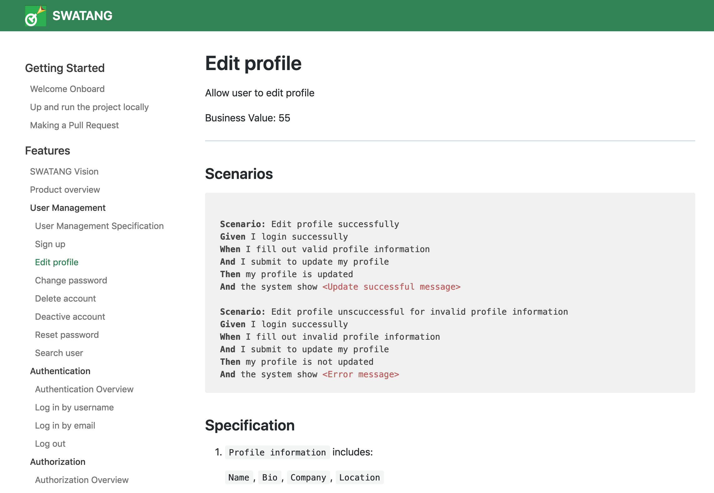
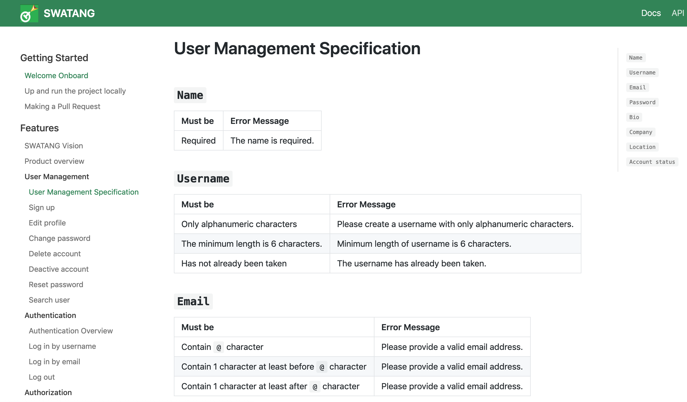
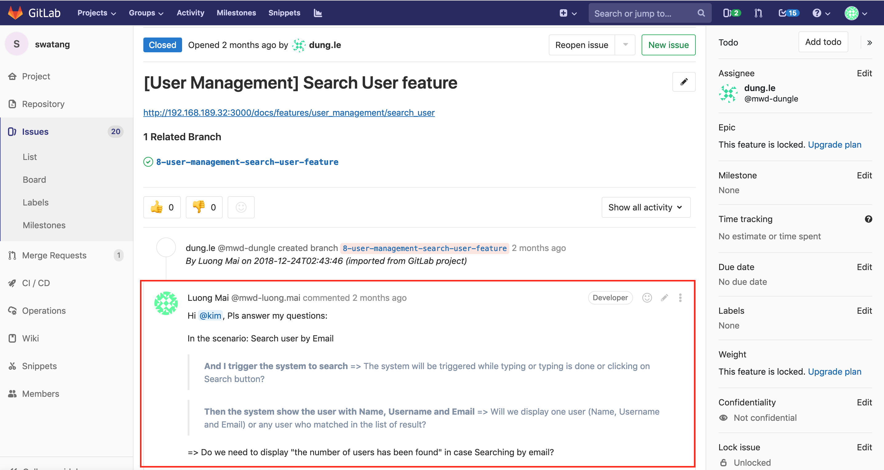
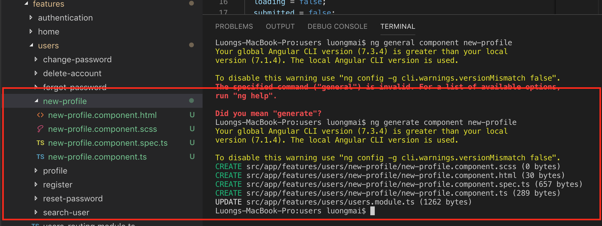
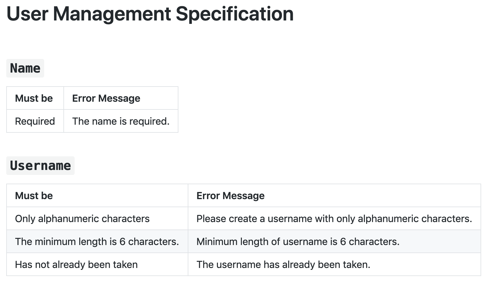
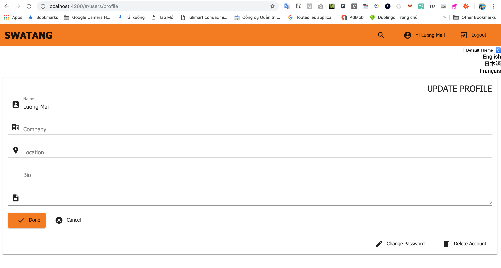
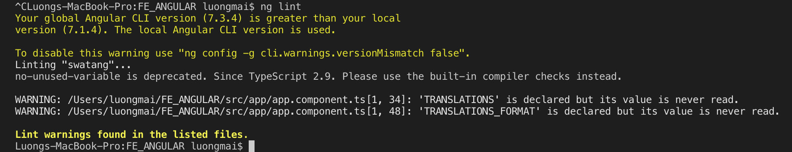
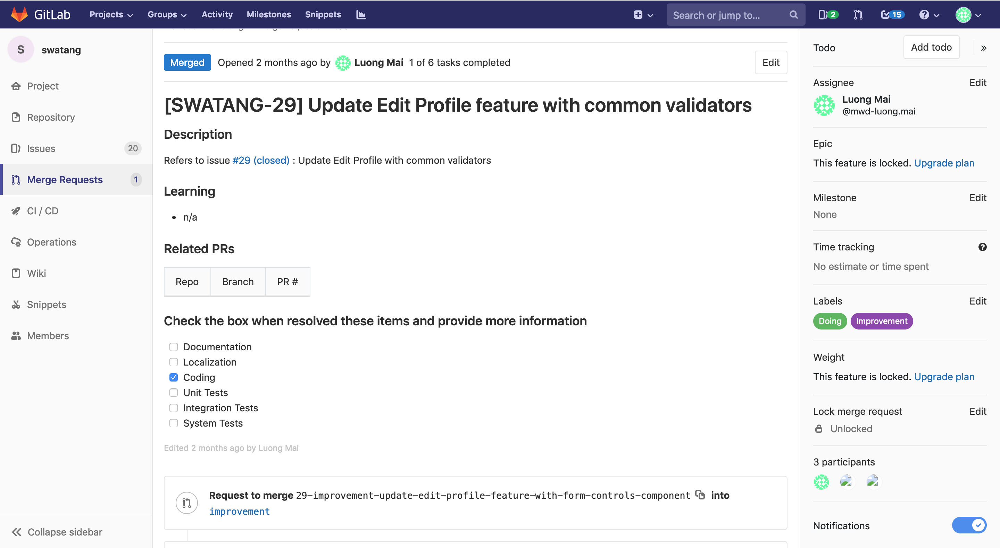

# MENU
- [MENU](#menu)
- [SWATANG OVERVIEW](#swatang-overview)
  - [Technology](#technology)
  - [Framework Structure](#framework-structure)
- [GET STARTED](#get-started)
  - [Understand requirements](#understand-requirements)
  - [Go forward with your branch](#go-forward-with-your-branch)
  - [Build and run SWATANG app](#build-and-run-swatang-app)
  - [SWATANG app configuration](#swatang-app-configuration)
  - [Create new component for your feature](#create-new-component-for-your-feature)
  - [Give your component a route to access via browser](#give-your-component-a-route-to-access-via-browser)
  - [Unit testing for your component](#unit-testing-for-your-component)
  - [Coding Style Checking](#coding-style-checking)
  - [Make a Merge request](#make-a-merge-request)
  - [Merge Request Rules](#merge-request-rules)
  - [CI (Continuous Integration)](#ci-continuous-integration)
    - [CI for checkout source, code checking and unit testing](#ci-for-checkout-source-code-checking-and-unit-testing)
    - [CI for build and publish SWATANG app as a Docker image](#ci-for-build-and-publish-swatang-app-as-a-docker-image)
    - [CI for E2E Testing](#ci-for-e2e-testing)

# SWATANG OVERVIEW
## Technology
1. Development Environment
- Node.js as an open-source, cross-platform JavaScript run-time environment that executes JavaScript code outside of a browser.  
- NPM to manage packages.
- Angular CLI for create projects, generate application and library code, and perform a variety of ongoing development tasks such as testing, bundling, and deployment.
- Angular is a platform and framework for building client applications in HTML and TypeScript.
- TypeScript language to implement optional functionality in Angular Framework.

2. UI Layout / Components
Using Flex Layout to
  develop responsive layout, mobile-first web sites

1. UI Styling
Using standard CSS, SCSS, Angular Material

4. Themes
Applying custom Material themes, we able to change default theme in the application.
Support tools for make a custom theme:
  - https://material.io/design/color/#tools-for-picking-colors

5. Functional Programming Language
- TypeScript 3.1
- JavaScript ES6/ES2015

6. Authentication
- Using JWT Token (based on Back-End)

7. Authorization
- Using Guards to protect routes to limit pages which user are able to access or not.

8. Asynchronous Handling
- Using Observables to handle asynchronous operations
- Support Reactive Programming using observables with RxJS Library

9. Communicate with BackEnd service 
- Using HttpClient from `@angular/common/http`

10. Error Request Handling
- Using a Intercepter class which implemented from `HttpInterceptor` to catch HTTP errors

11. Unit Testing
- Using Karma & Jamine
- Implement Unit Test in *.spec.ts files and run them with command line `ng test`
- Generate HTML, Console reports
- Generate Code Converage report

12. End To End Testing
- Using Protractor & Cucumber framework
- Support BDD
- Generate HTML report

13. Code Checking
- Using TSLint to check TypeScript code with defined rules in `tslint.json`

14. Coding Optimization
- Implement individual services, components.
- Builing common components for reuse source code
- Using `<outlet>` to optimize HTML layout
- Field validators are collected in a place as Field Specification for manage easily.
- Applying Lazy Load to reduce loading time of application for starting. 

15. Apply CI (Continuous Integration) using Circle CI for manage code quality (coding style, unit testing), build source, publish app as an Docker image and E2E testing.

## Framework Structure
```bash
angular.json  # configuration file for Angular CLI.
package.json  # lists the packages your project depends on.
tslint.json   # TSLint configuration file is used to configure which rules get run checking coding style.
src           # main source folder of the application. 
|__app
| |__core                   # CORE module
| | |__config               # application configuration file
| | |__guards               # authentication handler
| | |__interceptors         # interceptors for handle errors from HTTP request.
| | |__models               # general models
| | |__services             # core, base services provide methods for authentication, communicating with server,...
| | |__core.module.ts       
| | |__material.module.ts   # configuration Angular Material modules which the app are using.
| |__features                     # FEATURES module: all of features will be implemented at here.
| | |__home                       # HOME module: home page components implementation
| | | |__home.module.ts
| | | |__home-routing.module.ts
| | |__users                      # USERS module: all of user features will be implemented at here as components.
| | | |__change-password          # change password component: change password feature implementation.
| | | |__delete-account           # ...
| | | |__forgot-password
| | | |__...
| | | |__users.module.ts          # declare users components at here
| | | |__users-routing.module.ts  # routing configuration for user components
| |__shared                 # SHARED module: everything be used in: components, services, ... inside the application.
| | |__components           # common components: input, textarea, loading,...
| | |__constants            # common constants
| | |__fake                 # fake back-end api configuration
| | |__specs
| | |__testing
| | |__validation           # form field specification, common validators, validation service.
| | |__shared.module.ts
| |__app.component.ts       # features which impress to other component at app level should be implemented at here: change app theme, change app language,...
| |__app.module.ts          # declare/import modules which are using in the application
| |__app.routing.module.ts  # app routing configuration, lazy loading,...
|__locale                   # translated message for multiple languages will be generated inside here.
|__index.html               # index.html file
|__karma.conf.js            # karma configuration file for unit testing
|__main.ts                  # main file 
|__style.scss               # app styling file
|__theme.scss               # theme style configuration
```

# GET STARTED
##  Understand requirements
1. Take a look carefully the picked feature description.


2. ...and field specifications


3. Make questions for any your concerns on a related ticket and follow it.


##  Go forward with your branch

Create a branch for your ticket from `developing` branch and link it to the ticket. Follow the format `git checkout -b feature-<ID Ticket>-<Branch Name>`

- `git checkout developing`
- `git checkout -b feature-2-edit-profile-feature`

## Build and run SWATANG app
1. Run command `npm install` to install depended packages
2. Run command `npm run start`. Angular Live Development Server is listening on localhost:4200
3. Open your browser on http://localhost:4200/

## SWATANG app configuration
1. Endpoint Web API: edit file `src/core/config/app-config.ts`
2. TSLint Coding Style Checking: edit file `src/tslint.json`
3. Karma Runner setting: edit file `karma.conf.js`

## Create new component for your feature
Angular Components like LEGO pieces. We create a component once but can use them multiple times in different parts of our website. Writing reusable code pieces? Sounds fun :)

1. Using Angular CLI to execute command `ng generate component <component name>` to create a component automatically inside `features` folder. 
Components should be grouped by a domain like users, home, ...
- `ng generate component profile`



2. Building a form object using Form Builder. Let's open the file `profile.component.ts`.

- Follow field specification to create a form object and configure form fields using validator methods in `FieldSpecs` (`shared/validation/field-spec.ts`) and `Validators` Angular build-in class



```
  ngOnInit() {
    this.updateProfileForm = this.formBuilder.group({
      id: [''],
      name: ['', [FieldSpecs.fieldRequiredValidator('nameRequired'), Validators.maxLength(50)]],
      bio: ['', [FieldSpecs.fieldRequiredValidator('profileBioRequired'), Validators.maxLength(255)]],
      ...
    });
    this.loadProfileData(this.currentUser);
  }
```
- `nameRequired`, `profileBioRequired` constants for field validator messages which defined in `shared/validation/validation.service.ts`.

```
private fieldValidationMessages = {
    usernameMinLength: 'Minimum length of username must be 6 characters.',
    usernameRequired: 'Username is required.',
    usernamePattern: 'Username must contain only alphabetic characters.',
    nameRequired: 'Name is required.',
    nameMaxLength: 'The maximum length of name is 50 characters.',
    ...
  }

```

-  With new common validators, define them in `FieldSpecs` class for reusable `shared/validation/field-spec.ts`. To use call them `FieldSpecs.usernameValidator`

```
  static usernameValidator(control: AbstractControl): { [key: string]: boolean } | null {
    const username = control.value.trim();

      const usernameRequired = !username;
      const usernameMinLength = username.length < USER_NAME_MIN_LENGTH;
      const usernamePattern = !USER_NAME_PATTERN.test(username);

      if (usernameRequired) {
        return { usernameRequired };
      }
      return finalizeValidationResult({ usernameRequired, usernameMinLength, usernamePattern })
  }
```
3. Building a form template using Angular Material, Material Icon and `<form-input>` components. Let open the file `profile.component.html`

```
<mat-card>
  <mat-card-title>Update Profile</mat-card-title>
  <mat-card-content>
    <form [formGroup]="updateProfileForm" (ngSubmit)="onSubmit()">
      <input type="hidden" formControlName="id" class="form-control" />

      <form-input formControlName="name" [type]="'text'" [errors]="f.name.errors" [errorVisible]="submitted"
        [placeholder]="'Name'" [icon]="'account_box'"></form-input>

      <form-input formControlName="company" [type]="'text'" [errors]="f.company.errors" [errorVisible]="submitted"
        [placeholder]="'Company'" [icon]="'business'"></form-input>

      ...

      <div>
        <button mat-raised-button [disabled]="loading" color="primary" type="submit" (click)="onSubmit()">
          <mat-icon><i class="material-icons md-dark">done</i></mat-icon>Done
        </button>
        <a mat-button routerLink="/" class="btn btn-link">
          <mat-icon><i class="material-icons md-dark">cancel</i></mat-icon>Cancel
        </a>
      </div>
    </form>
  </mat-card-content>
</mat-card>
<app-loading [visible]="loading"></app-loading>
```
`form-input` is a common component which implemented in `shared/components/input` with input paramaters that need to provided from parent.

```
@Input() errorVisible = false;      # flag condition to display error message
@Input() errors: ValidationErrors;  # validation error array 
@Input() type: string ="text";      # "textarea" or "text"
@Input() rows: number = 1;          # for textarea
@Input() errorsDef: any
@Input() placeholder: string = '';
@Input() icon: string = '';         # Material Icon class name
```
4. Handling submit() action.
- Open the file `profile.component.ts` create a function to handle when submit a `Edit Profile` form.

```
onSubmit() {
    # turn on submitted flag to display validation message.
    this.submitted = true;

    # turn on loading flag to display loading icon while process submitting.
    this.loading = true;

    # validate field form
    if (this.updateProfileForm.invalid) {
      this.loading = false;
      return;
    }

    # using user service to update profile to database via Web API as well as handling success or error case for next actions.
    this.userService.update(this.updateProfileForm.value)
      .subscribe(
        _ => {
          this.alertService.success('Profile updated successfully.', true);
          this.submitted = false;
          this.loading = false;
          this.router.navigate(['/']);
        },
        error => {
          this.alertService.error(error);
          this.submitted = false;
          this.loading = false;
        });
  }
```
5. `update` api is implemented in Core module `src/app/core` and provided via `user.service.ts`

- Configure a route web API
```
const routes = {
  ...
  user: (id: string) => `/users/${id}`,
  ...
};
```
- Using HTTPClient to do API request
```
update(user: User) {
  return this.apiService.put(routes.user(user.id), user)
    .pipe(
      tap(_ => {
        this.updateUserLocal(user);
      })
    );
}
```
## Give your component a route to access via browser
1. Open the file `user.routing.module.ts`
2. Add a path to your component
```
const routes: Routes = [
  {
    path: '',
    redirectTo: '/users/profile',
    pathMatch: 'full'
  },
  {
    path: '',
    children: [
      ...
      { path: 'profile', component: ProfileComponent, canActivate: [AuthGuard] },
      ...
    ]
  }
];
```


## Unit testing for your component
1. Refers to `https://angular.io/guide/testing#component-test-basics` for component testing in Angular document. 

2. Open the file `profile.component.spec.ts` and let's start
- Using TestBed to provide and inject depended services, modules, component, mock service before creating component by TestBed and call function `createComponent` to create a Profile component instance for testing.
```
describe('ProfileComponent', () => {
  beforeEach(async(() => {

    TestBed.configureTestingModule({
      declarations: [ ProfileComponent, LoginComponent ],
      imports: [
        BrowserAnimationsModule,
        SharedModule,
        CustomMaterialModule,
        ReactiveFormsModule,
        RouterModule.forRoot([]),
        HttpClientModule,
        RouterTestingModule.withRoutes([{ path: 'login', component: LoginComponent}])
      ],
      providers: [
        ProfileComponent,
        {provide: AuthenticationService, useClass : TestAuthenticationService},
        {provide: UserService, useClass : TestUserService}
        ]
    })
    .compileComponents()
    .then(createComponent);
  }));

  # Write test cases at here
  ...
}
```
- Define `createComponent` function
```
function createComponent(){
  fixture = TestBed.createComponent(ProfileComponent);
  component = fixture.componentInstance;

  fixture.detectChanges();

  return fixture.whenStable().then(() => {
    fixture.detectChanges();
  });
}
```
- Writing test cases.
**Note**: Using `fakeAsync()` for testing asynchronous code and `tick()` to wait asynchronous methods is done.
```
it('should load current profile data', () => {
    const testUser = getTestUsers()[0];
    expect(component.f.name.value).toEqual(testUser.name);
    expect(component.f.bio.value).toEqual(testUser.bio);
    expect(component.f.company.value).toEqual(testUser.company);
    expect(component.f.location.value).toEqual(testUser.location);
  });

  it('should display success message when updating profile with valid data', fakeAsync(() => {
    const testUser = getTestUsers()[0];
    const userServiceSpy = fixture.debugElement.injector.get(UserService);
    const alertServiceSpy = fixture.debugElement.injector.get(AlertService);
    const updateSpy = spyOn(userServiceSpy, 'update').and.callThrough();
    const alertSuccessSpy = spyOn(alertServiceSpy, 'success').and.callThrough();

    component.f.name.setValue(testUser.name + "Edited");
    component.f.bio.setValue(testUser.bio + "Edited");
    component.f.company.setValue(testUser.company + "Edited");
    component.f.location.setValue(testUser.location + "Edited");

    component.onSubmit();
    tick();

    expect(updateSpy.calls.any()).toBe(true, 'UserService.update should be called');
    expect(alertSuccessSpy.calls.any()).toBe(true, 'AlertService.success called');
    expect(component.loading).toBe(false, 'Loading status should be false');
    expect(component.submitted).toBe(false, 'Submitted status should be false');
  }))
```
- Run test cases by command `ng run test` from a terminal. For run specifical test file, open the file `src/test.ts` and edit the line:

```
const context = require.context('./', true, /\.spec\.ts$/);
```
- View report from the folder `karma_html`

## Coding Style Checking
Run the command `ng lint` and fix all coding style warnings before pushing your code.


## Make a Merge request
1. Commit and push your source code to current remote branch
2. Follow guidelines to make a Merge request to `developing` branch and request reviewers. The Merge request is approved or not based on rules which are defined from team.

3. Follow your merge request and make sure CI/CD pipelines are PASSED and NOT CONFLICTED.

## Merge Request Rules
Note: Circle CI jobs will be triggered to verify quality from changes on your branch when making a merge request.

1. A merge request for `feature-` branch to merge into `develop` branch have to be: 
- **PASSED** `code-checking` and `unit-test` 
- Approved from least 2 reviewers.
- No conflicted
- Updated to date branch
2. A merge request to merge into `staging` or `master` branch have to: 
- **PASSED** `code-checking`, `unit-test`, `build`, `build-docker`
- Approved from least 2 reviewers.
- No conflicted
- Updated to date branch
3. A merge request VALID have to follow MERGE REQUEST TEMPLATE which be defined.

## CI (Continuous Integration)
We are using CircleCI (https://circleci.com) to configure CI. You need to link your github/bitbucket account to CircleCI first step. The CircleCi will syncs with your github to collect all of git repositories and you are able to select a git repo to configure CI then.

### CI for checkout source, code checking and unit testing
1. Go to `Add Projects` and following your SWATANG app repo which fetched from your github account
2. Go to your project like `https://circleci.com/gh/mwd-luongmai/swatang`
3. Go to `Settings` option
4. Configure `Environment Variables` by adding some variables bellow
- DOCKER_LOGIN : Docker.com username
- DOCKER_PASSWORD: Docker.com password
- GH_EMAIL: github email
- GH_NAME: github name
- GH_REPO: github repository ssh link which you will deploy SWATANG app to github page.
- DOCKER_HUB_REPO: docker.com hub repository to store Docker Image
5. Trigger CI jobs
- With any changes (git push, merge ...) on any branchs will trigger CI jobs **setup-enviroment**, **code checking** and **unit testing** from Circle CI site.

### CI for build and publish SWATANG app as a Docker image
On the same project of SWATANG app,
- With any changes (git push, merge ...) on develop, staging, master branchs will trigger **build** job as well as *setup-enviroment*, *code checking* and *unit testing* jobs in required job list to verify source code once again before publish an docker image.
- An docker image is only builded from staging or master branch and publish to Docker hub for testing or demo.

### CI for E2E Testing
We are using CircleCI and docker compose (docker-compose.yml and .Dockerfile) to setup testing enviroment in docker containers for: AUT (SWATANG app), Selenium Hub, Selenium Node (Chrome, Firefox,...), E2E before run testing.

1. Go to `Add Projects` and following your End To End Testing repo which fetched from your github account
2. Go to your project like `https://circleci.com/gh/mwd-luongmai/e2e-angular`
3. Go to `Settings` option
4. Configure `Environment Variables` by adding some variables bellow
- DOCKER_COMPOSE_PROJ_NAME: define a name of docker compose project to be used as prefix docker container, image, network.... **Please use lowercase letters without special, -, _ characters.** Example: angulare2e, e2e.
- DOCKER_LOGIN : Docker.com username
- DOCKER_PASSWORD: Docker.com password
5. Trigger CI jobs
- With any changes (git push, merge ...) on master branch will trigger CI jobs **setup-enviroment**, **code checking** and **e2e-test** from Circle CI site to setup test enviroment and run e2e test scripts.
6. View report
- Open `Artifacts` tab from a `e2e-test` build to review test report after this build is completed.
